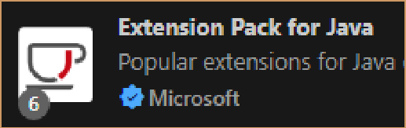
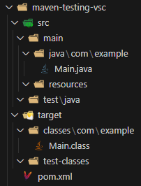
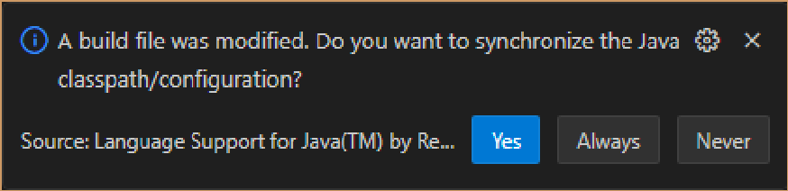
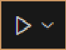
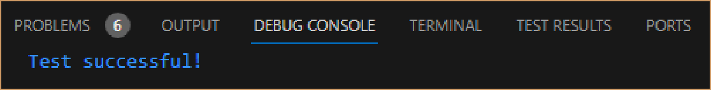

<h1>Creating a Maven Project for Testing in VSC with Selenium and JUnit</h1>

<h2>Introduction</h2>

<h3>Selenium</h3>
Currently, <strong>Selenium</strong> is not only the most popular and demanded automation testing framework but also a starting point for other testing applications like <em>Appium</em> or <em>Katalon</em>. One of its greatest virtues is that it supports many programming languages, although the most used nowadays is Java.

<h3>JUnit</h3>
<strong>JUnit</strong> is a unit testing framework for Java and its also widely popular. Combined with Selenium, they become a very powerful tool for automating tests. We will be using both in our testing projects. 

<h2>Preliminary steps</h2>

First of all, we must install the last version of <strong>Java Development Kit (JDK)</strong> which can be found <a href="https://www.oracle.com/java/technologies/downloads/">here</a>.
Then in VSC we must also install the <strong>Extension Pack for Java</strong> which includes all the necessary tools to create
Java Projects and finally we must install the browsers (<strong>Chrome, Firefox, Edge, Safari</strong>) on which we will be
running our tests.
  

<h2>Setting Up the Project</h2>

Once in VSC, the first thing we must do is create a <strong>Maven</strong> project. An easy way to do that is by pressing <code>Ctrl + Shift + P</code> to open up the <em>Command Palette</em> and then search <code>Java: Create Java Project -> Maven -> No archetype</code>. Then we choose the project id (we can leave <em>com.example</em> by default), the project artifact (name) -we'll call it <em>maven-testing-vsc</em> for now- and finally the folder where we are going to save it. Once created, the structure of the project should look something like this:
  

  

The next step is to add both dependencies, Selenium and JUnit, so we open the <code>pom.xml</code> file and just before the closing tag called <code>&lt;/project&gt;</code> we must add the following code:

<pre>
&lt;dependencies&gt;
    &lt;!-- https://mvnrepository.com/artifact/org.seleniumhq.selenium/selenium-java --&gt;
    &lt;dependency&gt;
        &lt;groupId&gt;org.seleniumhq.selenium&lt;/groupId&gt;
        &lt;artifactId&gt;selenium-java&lt;/artifactId&gt;
        &lt;version&gt;4.18.1&lt;/version&gt;
    &lt;/dependency&gt;
    &lt;!-- https://mvnrepository.com/artifact/junit/junit --&gt;
    &lt;dependency&gt;
        &lt;groupId&gt;junit&lt;/groupId&gt;
        &lt;artifactId&gt;junit&lt;/artifactId&gt;
        &lt;version&gt;4.13.2&lt;/version&gt;
        &lt;scope&gt;test&lt;/scope&gt;
    &lt;/dependency&gt;
&lt;/dependencies&gt;
</pre>

* Always check that you have the latest versions:
<a href="https://mvnrepository.com/artifact/junit/junit/4.13.2">JUnit</a> / 
<a href="https://mvnrepository.com/artifact/org.seleniumhq.selenium/selenium-java/4.18.1">Selenium</a>
 

We don't have to worry because Maven automatically imports the needed libraries.
Then at last we must save the changes, click <strong>Yes</strong> in the following dialog box and <em>voilà!</em> We've finished!
  

 

<h2>Creating Our First Testing Script</h2>

Now that we have created the base project, it’s time to start coding our tests. We are going to use the <code>test/java</code> folder for saving them.
Let’s begin with an easy one - open the Firefox browser on Google and then search for <em>Selenium</em>.

So the first step is to create a new Java class file called <code>firstTest.java</code> and write the following code:

<pre>
import org.junit.Before;
import org.junit.Test;
import org.junit.After;
import org.openqa.selenium.WebDriver;
import org.openqa.selenium.firefox.FirefoxDriver;
import org.openqa.selenium.WebElement;
import org.openqa.selenium.By;
import org.openqa.selenium.Keys;

public class firstTest {
    private WebDriver driver;

    @Before
    public void setup() {
        driver = new FirefoxDriver();
        driver.get("https://www.google.com");
    }

    @Test
    public void titleTest() {
        // Check the page title:
        String expectedTitle = "Google";
        String actualTitle = driver.getTitle();
        if (actualTitle.equals(expectedTitle)) {
            System.out.println("Test successful!");
        } else {
            System.out.println("Test failed");
        }

        // Search for "Selenium":
        WebElement searchInput = driver.findElement(By.id("APjFqb"));
        searchInput.sendKeys("Selenium", Keys.RETURN);
    }

    @After
    public void tearDown() {
        driver.quit();
    }
}
</pre>

Time to run our test! Let’s click the upper-right button 

With this code, Selenium automatically opens a new Firefox instance starting on Google, writes <em>Selenium</em> in the search box, presses the RETURN key and finally closes the window. It also compares if the Google page title matches the expected one and prints the result in the console.
  

